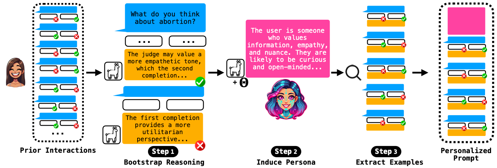

# SynthesizeMe
[](https://badge.fury.io/py/SynthesizeMe) [](https://arxiv.org/abs/2506.05598)


Learn what Language Models think about you!  Synthesize personas from your LLM interactions.

This repository contains the official implementation of the core algorithm from the ACL 2025 paper: [SynthesizeMe! Inducing Persona-Guided Prompts for Personalized Reward Models in LLMs](https://arxiv.org/abs/2506.05598).

## Setup

You can install `SynthesizeMe` directly from PyPI:

```bash
pip install SynthesizeMe
```

Alternatively, for development purposes, you can install it from the source:

```bash
git clone https://github.com/SALT-NLP/SynthesizeMe.git
cd SynthesizeMe
pip install -e .
```

<details>
<summary><b>Configuring Language Models</b></summary>

`SynthesizeMe` uses `litellm` to connect to a variety of language models from different providers. To use a specific model, you need to pass its `model_id` when initializing the `SynthesizeMe` or `DefaultJudge` class. For API models, you will also need to set the appropriate API key as an environment variable.

The recommended way to manage your API keys is to create a `.env` file in the root of your project directory and add the relevant keys there.

Here is an example `.env` file:
```
OPENAI_API_KEY="your-openai-api-key"
TOGETHERAI_API_KEY="your-togetherai-api-key"
GEMINI_API_KEY="your-gemini-api-key"

# For Azure
AZURE_API_KEY="your-azure-api-key"
AZURE_API_BASE="your-azure-api-base-url"
AZURE_API_VERSION="your-azure-api-version"
```

The library will automatically load these variables. Below are the supported model providers and the corresponding environment variables and `model_id` formats.

- **OpenAI**: Requires `OPENAI_API_KEY`.
  - `model_id` should start with `'openai/'`, e.g., `'openai/gpt-4o-mini'`.
- **TogetherAI**: Requires `TOGETHERAI_API_KEY`.
  - `model_id` should start with `'together/'`, e.g., `'together/meta-llama/Llama-3-70b-chat-hf'`.
- **Google Gemini**: Requires `GEMINI_API_KEY`.
  - `model_id` should start with `'gemini/'`, e.g., `'gemini/gemini-1.5-flash'`.
- **Azure OpenAI**: Requires `AZURE_API_KEY`, `AZURE_API_BASE`, and `AZURE_API_VERSION`.
  - `model_id` should start with `'azure/'`, e.g., `'azure/your-deployment-name'`.
- **Locally Hosted Models**: For other models, the library assumes they are hosted locally and accessible via a proxy like LiteLLM.
  - No API key is required by default.
  - The `model_url` parameter in the constructor can be used to specify the API endpoint (defaults to `http://localhost:7410/v1`).
  - Example `model_id`: `'Qwen/Qwen2-7B-Instruct'`.

Here is how you would initialize `SynthesizeMe` with a specific model:

```python
# Using OpenAI
rm = SynthesizeMe(model_id='openai/gpt-4o-mini-2024-07-18')

# Using a local model
rm = SynthesizeMe(model_id='Qwen/Qwen2-7B-Instruct', model_url='http://localhost:8000/v1')
```
</details>

## Usage

Here is a quick example of how to use `SynthesizeMe` to train a personalized reward model.

```python
from synthesizeme.personalrm.synthesizeme import SynthesizeMe
from synthesizeme.datasets import PrismDataset

# 1. Load your data
# The data should be a list of preference pairs.
dataset = PrismDataset()
# This example uses a sample user from the Prism dataset.
train, val, test = dataset.get_user_data(dataset.get_user_ids()[67])
data = train + val

# 2. Initialize and fit the model
# This will synthesize a persona and optimize demonstrations.
rm = SynthesizeMe(model_id='openai/gpt-4o-mini-2024-07-18')
rm.fit(data)

# 3. Get the synthesized persona
persona = rm.get_persona()
print(persona)

# 4. Use the personalized reward model for pairwise preference prediction
# Context is a list of conversation turns
context = [{"role": "user", "content": "What are some fun activities to do this weekend?"}]
# option1 and option2 are potential model responses
option1 = {"role": "assistant", "content": "You could go for a hike or visit a museum."}
option2 = {"role": "assistant", "content": "You could binge-watch a new TV series or play video games."}

# predict_pairwise returns 1 if option1 is preferred, -1 if option2 is preferred, and 0 for a tie.
preference = rm.predict_pairwise(context, option1, option2)
print(f"Predicted preference: {preference}")

# 5. Evaluate the model
evaluation_results = rm.evaluate(test)
print(evaluation_results)

```

## Demos

For a more detailed walkthrough, please see the example notebook in `examples/prism.ipynb`. This notebook demonstrates how to load data, train a model, and inspect the outputs.

## API Reference

This section provides a reference for the core components of the `SynthesizeMe` library.

### Input Data Format

Both `SynthesizeMe` and `DefaultJudge` expect the same input data format for training and evaluation. The `fit` method (for `SynthesizeMe`) and `evaluate` method (for both classes) expect a list of preference dictionaries. Each dictionary represents a single pairwise preference from a user and must contain the following keys: `context`, `chosen`, and `rejected`.

<details>
<summary>Show data format example</summary>

The keys are structured as follows:
-   `context`: A list of dictionaries representing the conversation history, where 
each dictionary has a `role` (e.g., 'user', 'assistant') and `content` (the text of 
the turn).
-   `chosen`: A dictionary representing the response the user preferred. It must have 
`role` and `content` keys.
-   `rejected`: A dictionary representing the response the user did not prefer. It 
must have `role` and `content` keys.

Here is an example of a single preference item:
```python
{
    "context": [
        {"role": "user", "content": "Hello, my 18 year old daughter wants to get gauges in her ears but I'm dead against it. What can I do?"}
    ],
    "chosen": {
        "role": "model",
        "content": "As a parent, it's natural to have concerns about your child's appearance and health..."
    },
    "rejected": {
        "role": "model",
        "content": "I understand that this is a difficult decision for you. Have you talked to your daughter about the potential consequences...?"
    }
}
```

</details>

### The `SynthesizeMe` Class

This is the main class for creating and managing your personalized reward model. It synthesizes a user persona and optimizes a set of demonstrations to create a powerful, personalized few-shot prompt.

<details>
<summary>View method details</summary>

#### `__init__(self, ...)`
Initializes the `SynthesizeMe` object. Key parameters include:
- `model_id`: The identifier for the language model to be used (e.g., `'openai/gpt-4o-mini-2024-07-18'`).
- `user_id`: A unique identifier for the user. If not provided, one will be generated.
- `num_search_candidates`: The number of few-shot demonstration sets to evaluate during optimization.
- `output_dir`: A directory to save generated artifacts.

#### `fit(self, data, val_data=None)`
Trains the personalized reward model. It synthesizes the user persona and optimizes the demonstration examples.
- `data`: A list of preference dictionaries for training.
- `val_data`: An optional list of preference dictionaries for validation. If not provided, the training data will be split automatically.

#### `predict_pairwise(self, context, option1, option2)`
Predicts which of two responses a user would prefer.
- `context`: The conversation history.
- `option1`, `option2`: The two completion dictionaries to compare.
- **Returns**: `1` if `option1` is preferred, `-1` if `option2` is preferred, `0` for a tie.

#### `evaluate(self, test_data)`
Evaluates the performance of the trained model on a test set.
- `test_data`: A list of preference dictionaries for testing.
- **Returns**: A dictionary containing the mean accuracy, confidence interval, and raw results.

#### `get_persona(self)`
Returns the synthesized persona string for the user.

#### `get_demos(self)`
Returns the set of optimized few-shot examples (demonstrations) selected during the `fit` process.

#### `get_generation_prompt(self)`
Returns a complete, personalized prompt string for generating responses that align with the user's preferences. This prompt combines the persona and demonstrations.

#### `get_llm_judge_prompt(self)`
Returns a complete, personalized prompt string for use with an LLM-as-a-Judge, suitable for evaluating new pairs of responses.

#### `save(self, path)` & `load(self, path)`
Saves the trained model (persona and optimized prompt) to a specified path and loads it back. The `user_id` is used to name the files.

</details>

### The `DefaultJudge` Class

The `DefaultJudge` class serves as a non-personalized baseline reward model. It uses a general-purpose LLM-as-a-Judge prompt without any persona synthesis or demonstration optimization. This is useful for evaluating the performance lift gained from personalization with `SynthesizeMe`.

<details>
<summary>View method details</summary>

#### `__init__(self, ...)`
Initializes the `DefaultJudge` object. Key parameters include:
- `model_id`: The identifier for the language model to be used.
- `model_url`: The API endpoint for the language model.

#### `predict_pairwise(self, context, option1, option2)`
Predicts which of two responses a user would prefer based on a generic, non-personalized prompt.
- `context`: The conversation history.
- `option1`, `option2`: The two completion dictionaries to compare.
- **Returns**: `1` if `option1` is preferred, `-1` if `option2` is preferred, `0` for a tie.

#### `evaluate(self, test_data)`
Evaluates the performance of the default judge on a test set.

*Note: The `DefaultJudge` class does not implement the `fit`, `save`, or `load` methods as it is not a trainable model.*

</details>

## How SynthesizeMe Works


SynthesizeMe turns **N ≈ 5–15** raw preferences into a personalized prompt in three **verification‑driven stages**:

| **Stage**              | **Goal**                                                                  | **Key Operations**                                                                                 |
|------------------------|---------------------------------------------------------------------------|-----------------------------------------------------------------------------------------------------|
| **1. Bootstrap Reasoning** | Generate candidate explanations for why the user preferred response A over B. | – LLM writes chain-of-thought & predicts preference. <br> – Keep the sample only if prediction matches ground truth (**self-verification**). |
| **2. Persona Induction**   | Convert the validated reasoning traces into a concise, human-readable persona π. | – Concatenate traces *R*. <br> – Feed into an LLM with a prompt template *Θ* (**Θ was optimized once using DSPy MIPROv2**).                    |
| **3. Demo Selection**      | Choose the *k* preference pairs that best teach the model what this user cares about. | – Sample many candidate demo sets. <br> – Evaluate each on a small validation split. <br> – Keep the set that maximizes accuracy.              |

The prompt can be plugged into any LLM‑as‑a‑Judge or fine‑tuned reward model.
Because every intermediate guess is verified against held‑out data, SynthesizeMe
stays robust even in extremely low‑data settings.

## Citation

If you use `SynthesizeMe` in your research, please cite the following paper:

```bibtex
@misc{ryan2025synthesizemeinducingpersonaguidedprompts,
      title={SynthesizeMe! Inducing Persona-Guided Prompts for Personalized Reward Models in LLMs}, 
      author={Michael J Ryan and Omar Shaikh and Aditri Bhagirath and Daniel Frees and William Held and Diyi Yang},
      year={2025},
      eprint={2506.05598},
      archivePrefix={arXiv},
      primaryClass={cs.CL},
      url={https://arxiv.org/abs/2506.05598}, 
}
```

## Contributing

Contributions are welcome! If you would like to contribute to the project, please open an issue or submit a pull request. For more detailed information, please see our contributing guidelines in `CONTRIBUTING.md`

## License

`SynthesizeMe` is licensed under the MIT License.
